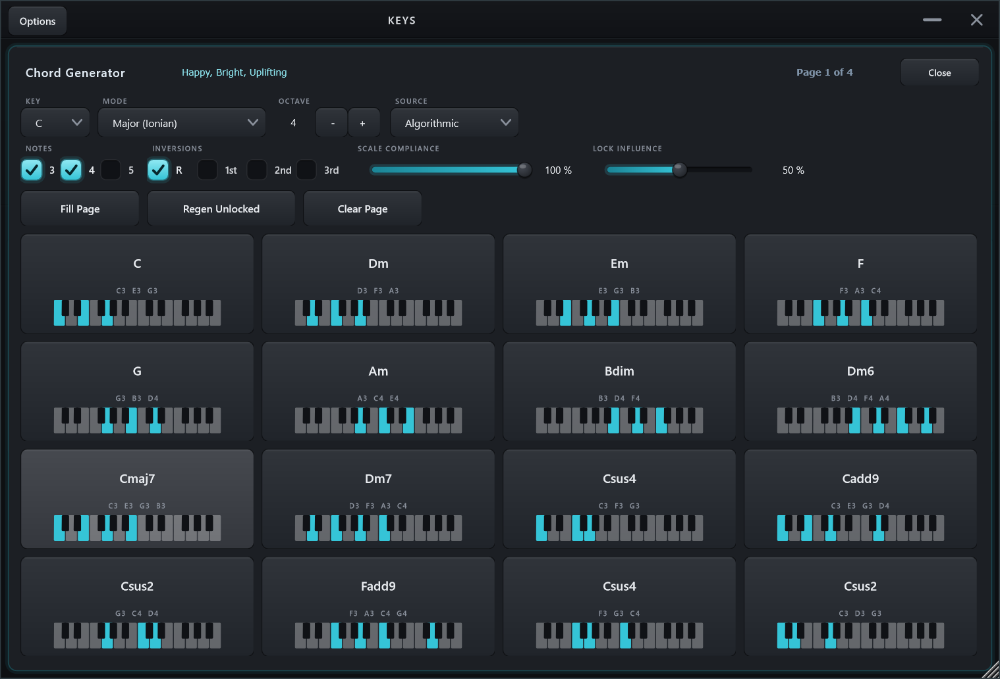

# Keys 🎹

An accessibility-first, **mouse-only playable MIDI keyboard** as a VST3 (and
standalone app). Keys makes no sound of its own: you click the on-screen piano and
it sends MIDI to whatever instrument sits downstream, in your DAW or over a virtual
port. Built for creators who work entirely with a mouse, including users with motor
disabilities: every control is a single click, a drag, or a scroll. No keyboard, no
modifier keys, and nothing ever *requires* a right-click (one optional right-click
accelerator exists: it latches a note, and the on-screen Latch toggle does the same).

Because it is a plugin, **your setup travels with the song**: keyboard size,
scale-lock, octave, channel, velocity, sustain, latch, the Humanize settings, the
eight knob CC assignments, and
your captured chord pads all save into the DAW project and come back when you reopen
it. And it drops straight onto a track, with no loopMIDI to configure.

Built with **JUCE 8** and **CMake**, on the shared
[`okstudio-juce-kit`](../okstudio-juce-kit).

**Two products build from this repo:**

- **Keys**: the keyboard itself, driving a downstream instrument over MIDI.
- **Keys Host**: the keyboard *plus one hosted instrument VST3* in a single plugin
  on a single track. Pick the synth from an in-window browser that files every installed
  VST3 into a collapsible folder per publisher; its
  GUI opens in its own floating window; its complete state (including MIDI Learn
  mappings) saves inside the DAW project. The 8 knobs auto-bind to the synth's
  likeliest parameters (cutoff, resonance, envelope, and so on) by name. See
  [docs/ABLETON_LIVE.md](docs/ABLETON_LIVE.md) for how it fits Live.

The hex-grid sibling, **Hex Host**, moved out to its own repo: [`../Hex`](../Hex).

One view, no tabs: header controls, eight rotary CC knobs, the chord-pad strip, then
the playing surface.


## Playing it

| Gesture | Result |
|---------|--------|
| **Click** a key | Play that note |
| **Click and drag** | Glide across keys (monophonic) |
| **Latch on**, click keys | Toggle notes on and off to build and hold a chord |
| **Sustain on**, click several keys | Notes keep sounding after release, like a pedal; with the pedal down a glide leaves a trail; click **All Off** or turn Sustain off to release |
| **Right-click** a key (optional) | Toggle that one note held, without touching the Latch mode — the Octavium accelerator; All Off always clears it |
| **Knob row** | Eight rotary CC knobs above the keyboard, each with a one-click reassign button (see Controls below) |
| **Chord pads** | Build a chord, drag the live card onto a pad to capture it, then press the pad beat-pad style to play it (Sustain holds it). Drag a pad back onto the card to bring its notes up for editing |
| **Chords** | Open the generator: fill a page of pads for a key and mode, or ask what chord could come next |
| **All Off** | Stop every note on every channel gently: per-note offs plus CC123, so notes end through their release envelopes instead of being choked |

No gesture beyond a click, a drag, or a scroll is ever required. Latch and Sustain
are on-screen toggles, not modifier keys, on purpose; right-click exists only as the
optional shortcut above.

## Controls

| Control | What it does |
|---------|--------------|
| **Size** | 25 / 49 / 61 / 73 / 76 / 88 keys |
| **Root** + **Scale** | The key and scale used by Scale Lock |
| **Scale Lock** | Snap every played note to the nearest note in (Root, Scale) — you can't hit a wrong note. Out-of-scale keys are dimmed. |
| **Octave** | Transpose the whole keyboard by -5..+5 octaves |
| **Velocity** + **Curve** | Note velocity, shaped by a Soft / Linear / Hard response |
| **MIDI Ch** | Output channel, 1–16 |
| **Voices** | Polyphony limit: Off (unlimited) or 1–8 notes, stealing the oldest |
| **Mod / Pitch wheels** | Left of the keyboard: Mod sends CC1 and holds; Pitch bends and glides back to centre. Both move by relative drag, never jumping to a click |
| **Sustain** | Hold notes after release (pedal) |
| **Latch** | Click to toggle notes on/off and hold them |
| **Humanize** | Random velocity within a Min/Max range + micro-timing, so chords feel played |
| **Knobs** | Eight rotary CC knobs; the label under each opens a one-click reassign menu |
| **Chord pads** | Capture chords to sixteen pads a page (two rows) and press beat-pad style to play (Sustain holds); **Excl** chokes the last chord, **Strum** spreads a pad's notes Up / Down / Random. `<` / `>` move between four pages |
| **Chords** | The chord generator — see below |
| **All Off** | Stop everything |

Full detail in [docs/CONTROLS.md](docs/CONTROLS.md).

## The chord generator

**Chords** opens a panel that fills the current page of pads for a key and mode, so you
can have a progression to play with before you know any theory.



The fastest way in is a **Feel** preset: Happy, Sad, Dreamy, Dark, Jazzy, Bluesy, Epic,
Chill, Mysterious, Smooth. One click sets the key and mode, and moves Root and Scale to
match so Scale Lock agrees. Then **Fill Page**.

| Control | What it does |
|---------|--------------|
| **Key** + **Mode** | 12 modes, each showing the character it carries (Dorian is "Jazzy, Sophisticated, Chill") |
| **Scale Compliance** | How far outside the key it may go. 100% stays in the key; lower borrows from related modes, then reaches for secondary dominants, then anything |
| **Lock** | Keep a chord when you regenerate |
| **Lock Influence** | How much new chords copy the character of the ones you locked |
| **New** | A different chord for that pad's place in the scale (or, for a Markov chord, the next step of the chain) |
| **Next** | Chords that could follow this one — smooth voice-leading moves, circle-of-fifths, diatonic degrees, jazz substitutions — each with a play button to audition before it drops into the next free pad |
| **Notes** / **Inversions** | Generate triads, 7ths and/or 9ths; allow root position and inversions |
| **Source** | **Algorithmic** (the weighted pool above) or **Markov**: real-progression chains per Major / Minor / Modal, with **Temperature** (conservative to adventurous), **Length**, a **Mood** filter, and a **Start chord** |

Press any chord in the grid to hear it. Every action is an on-screen button: nothing
here needs a right-click either.

## Driving it with Claude

Keys embeds an MCP server, so Claude Code (or any local MCP client) can set
parameters, play notes and phrases, write and fire chord pads, and edit arp
patterns directly. See [docs/MCP.md](docs/MCP.md).

## Using it in Ableton Live

Keys loads as an instrument on a MIDI track and outputs MIDI, which Live routes into
any other instrument:

1. Drop **Keys** on MIDI Track A.
2. On MIDI Track B, load your instrument (piano, synth, anything).
3. On Track B set **MIDI From** to *Track A → Keys*, and **Monitor** to *In*.
4. Click the on-screen keys. Track B plays.

Full walkthrough: [docs/ABLETON_LIVE.md](docs/ABLETON_LIVE.md).

## Installing

Grab `KeysSetup-x.y.z.exe` from Releases and run it — it installs the VST3 where
DAWs look automatically (`C:\Program Files\Common Files\VST3`). Or build from source.

## Building

Requires CMake 3.22+, Visual Studio 2022, a JUCE 8 checkout at `../JUCE`, and the
kit at `../okstudio-juce-kit`.

```powershell
./build.ps1                 # VST3 -> %USERPROFILE%\Ableton\vst3
./build.ps1 -Standalone     # also build the standalone app
```

Or plain CMake:

```powershell
cmake -B build -G "Visual Studio 17 2022" -A x64 -DKEYS_COPY_PLUGIN=OFF
cmake --build build --config Release --target Keys_VST3
```

Details and troubleshooting: [docs/BUILD.md](docs/BUILD.md).

## Accessibility statement

Keys exists because most on-screen keyboards and controllers quietly assume two
hands and a keyboard. Its rules: every function is reachable with single left-clicks,
drags, and scrolls; no keyboard shortcut is ever required; no double-clicks, no
modifier keys, no precision gestures on the critical path; large targets and high
contrast. If something doesn't work for you with a mouse, that's a bug — open an
issue.

## License

Source is **MIT** (see `LICENSE`). Binaries link **JUCE**, which is licensed
separately (AGPLv3 or a commercial JUCE license); distributing them must satisfy
JUCE's terms.
