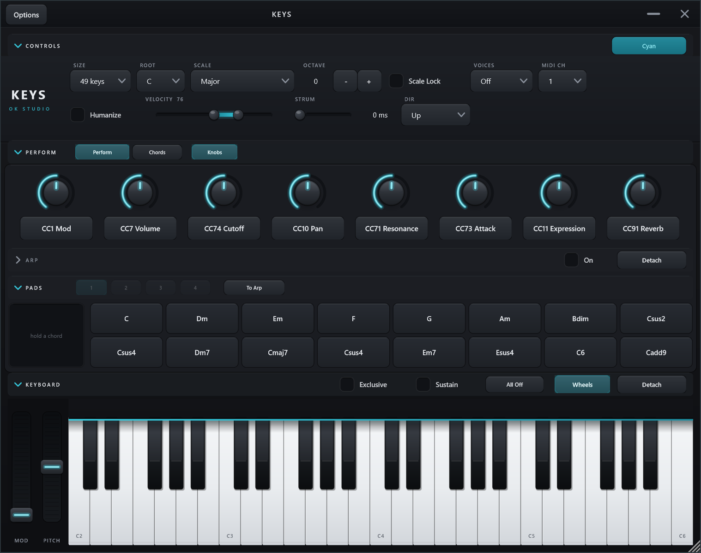
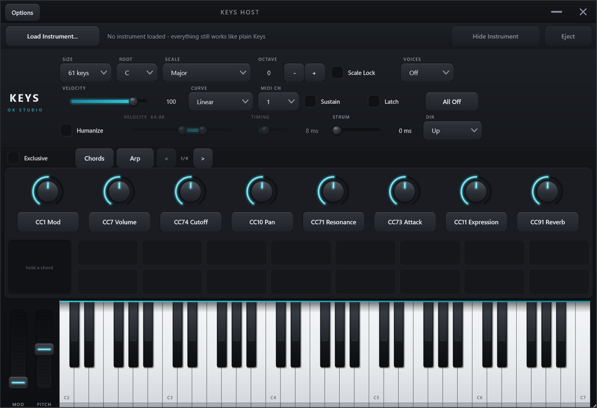

# Keys 🎹

An accessibility-first, **mouse-only playable MIDI keyboard** as a VST3 (and
standalone app). Keys makes no sound of its own: you click the on-screen piano and
it sends MIDI to whatever instrument sits downstream, in your DAW or over a virtual
port. Built for creators who work entirely with a mouse, including users with motor
disabilities: every control is a single click, a drag, or a scroll. No keyboard and no
modifier keys. Right-click is only ever an accelerator, with two exceptions Owen asked for:
**Send to arp slot**, in a chord card's menu, and releasing one note out of a chord the
**Sustain** pedal is holding. Neither has a left-click twin.

Because it is a plugin, **your setup travels with the song**: keyboard size,
scale-lock, octave, channel, velocity, sustain and latch, the Humanize settings, the
arpeggiator down to its step lanes and its twelve slots, which sections you
had folded away and which you had pulled out into windows of their own (down to where each
window sat), this instance's colour, the
eight knob CC assignments, and
your captured chord pads all save into the DAW project and come back when you reopen
it. And it drops straight onto a track, with no loopMIDI to configure.

Built with **JUCE 8** and **CMake**, on the shared
[`okstudio-juce-kit`](../okstudio-juce-kit).

**Two products build from this repo:**

- **Keys**: the keyboard itself, driving a downstream instrument over MIDI.
- **Keys Host**: the keyboard *plus one hosted instrument VST3* in a single plugin
  on a single track. Pick the synth from an in-window browser that files every installed
  VST3 into a collapsible folder per publisher; its
  GUI opens in its own floating window; its complete state (including MIDI Learn
  mappings) saves inside the DAW project. The 8 knobs auto-bind to the synth's
  likeliest parameters (cutoff, resonance, envelope, and so on) by name. See
  [docs/ABLETON_LIVE.md](docs/ABLETON_LIVE.md) for how it fits Live.

The hex-grid sibling, **Hex Host**, moved out to its own repo: [`../Hex`](../Hex).

One view, no tabs, and four sections stacked down the window: **Controls** (the dropdowns
and the eight knobs under them), the **arpeggiator**, the **chord pads**, and the **playing
surface**. Every section folds away so the window can be squeezed small: click the chevron
at the left of its bar, or the caption beside it. That left end is the target, and a
hairline shows where it stops, so a click that misses a bar control does nothing rather than
hiding the thing you were reaching for. Every section also detaches into a resizable window
of its own. An open section's bar is a ruled band with a tick of accent; a folded one goes
flat and dim, so the shape of the window reads before you have read a caption.





## Playing it

| Gesture | Result |
|---------|--------|
| **Click** a key | Play that note |
| **Click and drag** | Glide across keys (monophonic) |
| **Sustain on**, click several keys | Notes keep sounding after release, like a pedal; with the pedal down a glide leaves a trail, and clicking a ringing key **plays it again**. **All Off** stops everything |
| **Latch on**, click several keys | Each click holds that key, and clicking it again releases it — the way to build a chord note by note, or take one apart |
| **Right-click** a key (optional) | Toggle a hold on that one note, the Octavium accelerator. A key this keyboard is already holding lets go, so a walk along a ringing chord takes it apart a note at a time without lifting Sustain. Any other key latches on, and a plain **left click** releases that |
| **Knob row** | Eight rotary CC knobs, the bottom row of the Controls section, each with a one-click reassign button (see Controls below) |
| **Chord pads** | Build a chord, drag the live card onto a pad to capture it, then press the pad beat-pad style to play it (Sustain holds it). Drag a pad back onto the card to bring its notes up for editing |
| **Fill** / **Regen** | Two chips at the right of the Pads bar. Fill writes chords to the *empty* pads and never overwrites; Regen re-rolls the pads that already have one, except the locked ones. Everything else the chord generator does is on a pad's right-click menu |
| **All Off** | Stop every note on every channel gently: per-note offs plus CC123, so notes end through their release envelopes instead of being choked |

No gesture beyond a click, a drag, or a scroll is ever required. Sustain is an on-screen
toggle, not a modifier key, on purpose. Right-click opens the card menus on the chord pads
and the arp slots, and toggles a hold on a key; only **Send to arp slot** and releasing a
pedal-held note live nowhere else.

## Controls

| Control | What it does |
|---------|--------------|
| **Size** | 25 / 49 / 61 / 73 / 76 / 88 keys |
| **Root** + **Scale** | The key and scale used by Scale Lock |
| **Scale Lock** | Snap every played note to the nearest note in (Root, Scale) — you can't hit a wrong note. Out-of-scale keys are dimmed. |
| **Octave** | Transpose the whole keyboard by -5..+5 octaves |
| **Velocity** | A range. Humanize off plays its midpoint, on takes a random value inside it. Drag an end to resize, the middle to move the whole band, or collapse it for a fixed velocity |
| **MIDI Ch** | Output channel, 1–16 |
| **Voices** | Polyphony limit: Off (unlimited) or 1–8 notes, stealing the oldest |
| **Mod / Pitch wheels** | Left of the keyboard: Mod sends CC1 and holds; Pitch bends and glides back to centre. Both move by relative drag, never jumping to a click |
| **Sustain** | Hold notes after release (pedal). A repeated key is a repeated strike, so you can play over a chord that is still ringing |
| **Latch** | Click to hold a key, click again to release it. Sustain's twin, and the difference between them is exactly that second click |
| **Humanize** | Draw each note's velocity at random from the Velocity range, so repeats and chords don't sound machine-perfect |
| **Knobs** | Eight rotary CC knobs; the label under each opens a one-click reassign menu. They are the bottom row of the Controls section, and the **Knobs** chip on that bar folds just that row |
| **Chord pads** | Their own section, and the only chord cards in Keys. Capture chords to sixteen pads a page and press beat-pad style to play (Sustain holds); **Exclusive** chokes the last chord, **Strum** rakes a chord's notes Up / Down / Random over a time drawn from its range. Four numbered buttons on the Pads bar pick the page, and **Big** swaps the two rows of eight for four rows of four, each card showing the chord's notes and a mini keyboard |
| **MIDI in** | Play a hardware keyboard through Keys and its keys light up on screen, with the live card naming the chord. The stream passes through untouched |
| **BPM** | Tempo the arpeggiator runs at when there is no transport to follow — always in the standalone, and whenever the host is stopped. A playing host wins |
| **Arp** | Its own section too. The bar carries an **On** toggle and a **Hold off** chip, so the arpeggiator can be switched on and made to let go of a chord with the section folded shut; inside are the control band and twelve launchable slots, each holding a pattern and a chord that one click installs. With it on, clicking a chord card hands that chord to the arp and leaves it there. Twelve shapes (including **Chord**, which plays the whole held chord every step) plus **Pattern**, which opens a ten-lane step editor; **Distance** stacks the chord by scale degrees rather than fixed intervals; **Chain** plays the twelve slots as a progression, each for the bars its card shows |
| **Hold off** | On the Arp bar. Lets go of the chord being held into the arp and stops the Chain. Greyed out when there is nothing to let go of. Clicking the lit pad restrikes the chord instead, so this is the way to stop a hold outright |
| **Fill** / **Regen** | The chord generator, at the right of the Pads bar, with **Key**, **Mode** and **Scale Compliance** as combo boxes beside them. Every setting it has is on a pad's right-click menu as well. See below |
| **Theme** | Colour this instance, so you can tell it from Keys on your other tracks |
| **Detach** | On every open section bar: puts that section in a resizable window of its own. Re-dock from inside the window, or close it. Folded sections hide it, so unfold from the chevron first |
| **All Off** | Stop everything |

Full detail in [docs/CONTROLS.md](docs/CONTROLS.md).

## The chord generator

The generator fills the current page of pads for a key and mode, so you can have a
progression to play with before you know any theory. It has **no panel and no view of its
own**: the chords it makes are the sixteen pads, and there is exactly one set of chord cards
in Keys, so what you audition is what you play.

It is two chips, three combo boxes and a card menu.

**Fill** and **Regen** sit at the right-hand end of the Pads bar. Fill is the safe one: it
writes chords to the *empty* pads and leaves everything already on the page alone. Regen is
the one that overwrites, re-rolling the pads that already have a chord and skipping the ones
you locked. Each greys out when it would do nothing, so you can see which is which. Both
stay clickable when the pad strip is folded away, because they are the only left-click path
into generation. Unfold and the page is written.

**Key**, **Mode** and **Scale Compliance** are combo boxes on that same bar, left of the two
chips: the three settings you change while you are auditioning a page, one click to open and
one to pick. They stay put when the strip folds too, and they are the same settings as the
menu items of the same names, so setting one from either place shows in the other.

Everything else is on a **pad's right-click menu**:

| Item | What it does |
|------|--------------|
| **Lock** / **Unlock** | Keep this chord through a Regen. The lock chip in the card's top-right corner does the same thing with a left click |
| **Octave down** / **Octave up** | Move the whole chord an octave, without changing what it is |
| **Next voicing** | The same chord arranged differently: root position, the inversions, then a spread. Works on a locked card too, because a lock protects a chord from the generator and not from you |
| **New chord** | A different chord for that pad's place in the scale (or, for a Markov chord, the next step of the chain) |
| **Next: could follow** | Chords that could follow this one, in four families: smooth voice-leading moves, circle-of-fifths, diatonic degrees, jazz substitutions. Every row has a play button to audition it before it drops into the next free pad |
| **Clear page** | Empties the unlocked pads. It is a menu item and not a chip: sixteen pads is a lot to lose, Keys has no undo, and on the bar it sat a few pixels from the two things you click constantly |
| **Generator settings** | Every setting the generator has, each opening a short list with the current value ticked. One row, because the menu hangs off a pad near the bottom of the window and a long one runs off the top of the screen |

The settings: **Key** and **Mode** (12 modes, each showing the character it
carries, so Dorian reads "Jazzy, Sophisticated, Chill"), **Octave**, **Scale Compliance**
(how far outside the key it may go: 100% stays in, lower borrows from related modes, then
reaches for secondary dominants, then anything), **Lock Influence** (how much new chords copy
the character of the ones you locked), **Notes** and **Inversions** (triads, 7ths, 9ths; root
position and inversions), and **Source**. Source is **Algorithmic** (the weighted pool) or
**Markov**: real-progression chains per Major / Minor / Modal, with **Temperature**
(conservative to adventurous), **Length**, a **Mood** filter and a **Start** chord. Those five
are together under one **Markov chains** submenu, since none of them does anything until the
source is Markov. Settings that belong to one source grey out under the other rather than
being silently ignored.

Press any pad to hear it, and turn **Big** on (Pads bar) if you want to read each chord's
notes while you work.

## Driving it with Claude

Keys embeds an MCP server, so Claude Code (or any local MCP client) can set
parameters, play notes and phrases, write and fire chord pads, and edit arp
patterns directly. See [docs/MCP.md](docs/MCP.md).

## Using it in Ableton Live

Keys loads as an instrument on a MIDI track and outputs MIDI, which Live routes into
any other instrument:

1. Drop **Keys** on MIDI Track A.
2. On MIDI Track B, load your instrument (piano, synth, anything).
3. On Track B set **MIDI From** to *Track A → Keys*, and **Monitor** to *In*.
4. Click the on-screen keys. Track B plays.

Full walkthrough: [docs/ABLETON_LIVE.md](docs/ABLETON_LIVE.md).

## Installing

Grab `KeysSetup-x.y.z.exe` from Releases and run it — it installs the VST3 where
DAWs look automatically (`C:\Program Files\Common Files\VST3`). Or build from source.

## Building

Requires CMake 3.22+, Visual Studio 2022, a JUCE 8 checkout at `../JUCE`, and the
kit at `../okstudio-juce-kit`.

The configure is quick again. Keys used to carry an audio-to-MIDI Transcribe section, which
downloaded a multi-gigabyte prebuilt ONNX Runtime and forced the static MSVC runtime on the
whole binary; both came with that engine rather than being choices. The section is gone, so
neither cost is, and Keys is back on the default dynamic CRT. If you are reusing a build
directory configured before that, pass `-DOKSTUDIO_KIT_BASICPITCH=OFF` once to clear the
cached setting.

```powershell
./build.ps1                 # VST3 -> %USERPROFILE%\Ableton\vst3
./build.ps1 -Standalone     # also build the standalone app
```

Or plain CMake:

```powershell
cmake -B build -G "Visual Studio 17 2022" -A x64 -DKEYS_COPY_PLUGIN=OFF
cmake --build build --config Release --target Keys_VST3
```

Details and troubleshooting: [docs/BUILD.md](docs/BUILD.md).

## Accessibility statement

Keys exists because most on-screen keyboards and controllers quietly assume two
hands and a keyboard. Its rules: every function is reachable with single left-clicks,
drags, and scrolls, bar the two right-click gestures Owen asked for (the chord-card menus,
and releasing one note out of a pedal-held chord); no keyboard shortcut is ever required; no
double-clicks, no modifier keys, no precision gestures on the critical path; large targets
and high contrast. If something doesn't work for you with a mouse, that's a bug: open an
issue.

## License

Source is **MIT** (see `LICENSE`). Binaries link **JUCE**, which is licensed
separately (AGPLv3 or a commercial JUCE license); distributing them must satisfy
JUCE's terms.
