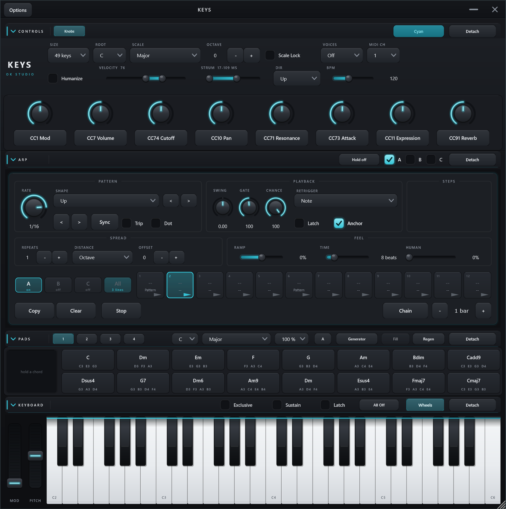
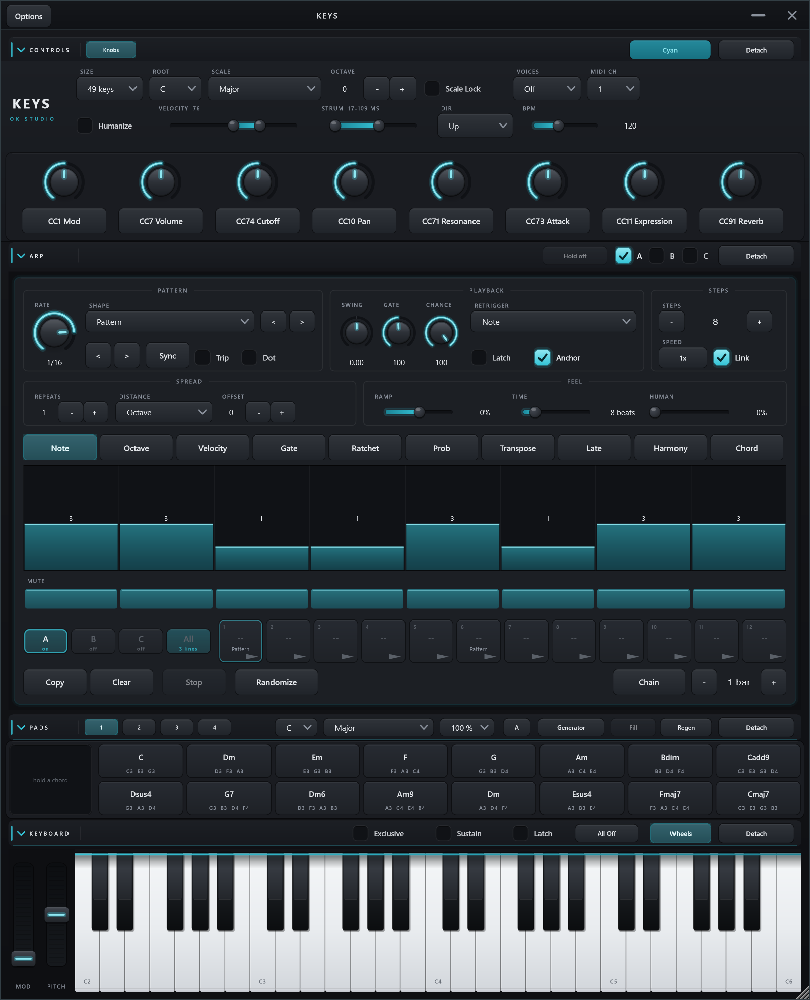
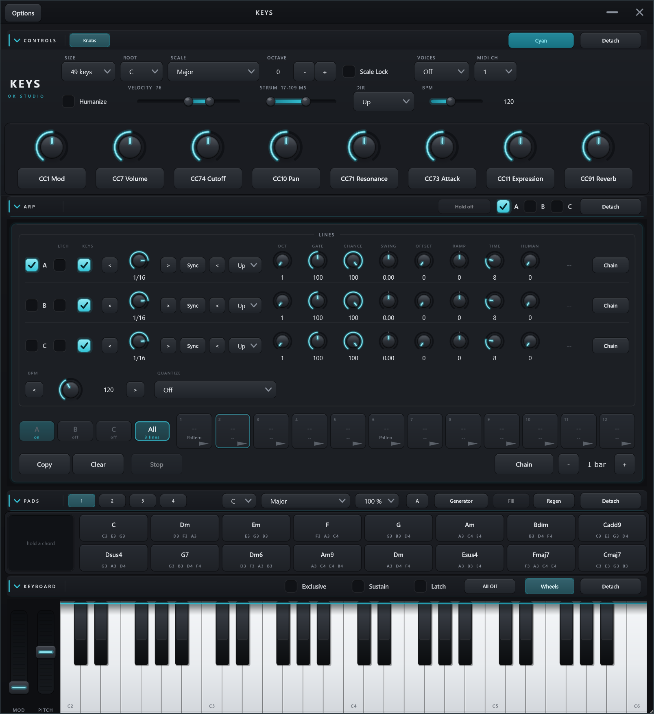

# Keys Arp: design spec (research-backed)

Distilled from a deep-research pass (2026-07-19) over the Xfer Cthulhu v1.1 manual,
Xfer Serum manual, Kirnu Cream and Devicemeister Stepic reviews and vendor docs, and
the JUCE ArpeggiatorPluginDemo source. Confidence notes and gaps at the bottom.

Shape "Up": no step editor exists, because most of the time you do not want one. The
control band, the twelve launchable slots and the chord cards below are there either way.



Shape "Pattern": the STEPS group joins the band, and lane tabs, the selected lane and its
mute row appear between the band and the slots.



The **All** tab: three lines at once, over the tempo and the Launch Quantize they share. Same
panel height as a shape, because the rows take the band's space rather than joining it.



## Placement and contract

A new stage in the MIDI path, in this order (Cthulhu's proven pipeline order):

```
surfaces / chord pads  ->  [chord resolution]  ->  ARP  ->  hosted instrument (Keys Host)
                                                        ->  track MIDI out (all products)
```

The arp consumes whatever is sounding (held, latched, or a ringing chord pad) and
must handle both single notes and full chords. It is bypassable; bypassed, the path
is exactly today's.

**Contract change, deliberate:** the arp engine reads the host playhead (bpm,
ppqPosition, isPlaying). Keys historically never reads the playhead; the arp stage
follows the Contour/Lattice model instead. `CLAUDE.md` carries the amendment: the
arp is the only playhead consumer in Keys.

## Three lines (2026-08-01)

Owen: *"three arpeggiators so we can get polyrhythms and keep keeping what we currently have,
but having three of them, and then being able to feed cards into different lines."*

There are three of everything above: three `ArpEngine`s, each with its own rate, shape, step
lanes, twelve slots, held chord and chain. **`ArpEngine.h` did not change.** It never knew how
many of it there were - it is handed a buffer, a `Params` and a clock, and it owns nothing
global - so three of them cost a routing layer above and no engine work at all.

**Line A is the arpeggiator that was already here, down to its parameter ids.** `arpRate`,
`arpSwing`, `arpDirection` and the rest register unchanged; B and C are the same list again
under `arp2*` / `arp3*`, appended and defaulting to off. That is the whole story for saved
sessions: one opens with its arp intact and two silent lines beside it.

### Routing is by queue, not by mask

Each line has its own `juce::MidiMessageCollector`. A chord handed to line B is fired through
the ordinary note path - so it lights the keybed, honours Exclusive and the Voices cap, and
sustains honestly when the line is off - but queued into *that line's* collector, and only its
engine drains it. `KeysProcessor::runArpLines` then:

1. asks which lines have **Keys** on (do they arpeggiate what you play);
2. if any do, lifts the note on/offs out of the merged stream into `keyNotes` and copies them
   into each listening line's input, leaving CCs and everything else to pass through. If none
   do, the stream is untouched - which is exactly the behaviour of the arp being off;
3. runs each enabled line into its own output buffer and merges them all back, restamping the
   channel if that line names one;
4. merges a *disabled* line's input straight through, so a chord held to a line that is off
   simply sustains.

**The alternative was a per-pitch ownership mask** - publish which line owns which pitch, and
let the audio thread route the merged stream by looking it up. It races: the message thread can
clear a pitch's owner before the matching note-off has been drained, and that note is then
stranded in an engine's held set with nothing left that can release it. A queue cannot get this
wrong, because the note-off is physically in the same queue its note-on went into.

**`noteRefs` is per destination stream now.** The old rule - one note-on per sounding pitch,
released by the last owner - is a statement about *one stream*, because downstream one note-off
ends a pitch for everybody. An arp line's input is a different stream with a different consumer
(its engine, which counts owners itself in `ArpEngine::Held::ons`), so a pitch held into line B
must not suppress the same pitch played to the track output. With one shared counter it did, and
the note vanished from the output while the key lit up.

### Known edge, pre-existing

Switching a line on while a chord is already ringing leaves that chord's note-off to be eaten by
the engine, so the pitch hangs downstream until All Off. This is not new - the single arp has
always done it on the off-to-on transition - and the lines make it three times as reachable
rather than differently wrong. Fixing it needs the destination's currently-held pitches closed
at the transition, which means the audio thread emitting note-offs for references the message
thread owns; not attempted here.

### On screen

- **A, B and C on the arp bar**, one per line's `arpOn`. On the bar, like the single On was, so
  a line can be brought in or out with the section folded. **Hold off stays one button** and
  releases every line and every chain.
- **Three tabs at the left of the slot row** select which line the panel edits - band, step
  lanes, the twelve slots, Bars, Chain. They cost no height: 34 px inside a row already 58 tall.
  Changing the tab tears down every APVTS attachment and rebuilds it against the new line's ids,
  which is the same move `refreshRateMode` has always made for the rate dial's two units, guard
  against swapping under an open drag included.
- **A letter chip on the Pads bar** says which line a chord-card click feeds, and cycles A-B-C.
  Same state as the tabs; it is on that bar because it is a fact about the cards, and because it
  has to be reachable with the arp folded shut.
- **Drag a chord card onto a slot** to bind it there, **onto a tab**, or **onto a line's row in
  the macro view**, to hand it over now. Screen-position hit-testing through
  `Desktop::findComponentAt`, mediated by the editor, for the reason the audition tray needs the
  same: mouse capture keeps the gesture on the strip and the two surfaces can be in different
  windows. Walking *up* from whatever is under the point is what makes the whole macro row a
  target including the knobs sitting on it - the knob is found first, and its parent is the
  line. A drop sets the current line but never changes the view: it is routing a chord, not
  navigating, and in the macro view the line it landed on is already in front of you.

### The macro view (the fourth tab)

Owen: *"a fourth option for a simplified version that shows a little bit of all of them ... the
goal is to be able to create complex polyrhythms from one view."*

**All** sits after C in the tab row and swaps the per-line band and the step editor for three
`MacroRow`s, over a shared row carrying the **BPM** knob and **Launch Quantize**. A row holds
the line switch, **Latch** and **Keys**, a detented rate knob with `<` `>` and its Sync/Hz
switch, the shape with steppers of its own, **eight knobs** - Oct, Gate, Chance, Swing, Offset,
Ramp, Time, Human - the held chord, and that line's Chain. Owen's brief when the first cut
carried three: *"what other knobs can we have? should be like regular arp settings."*

The knobs are the band's own machined rotary rather than sliders, and each column heading is
written once on the top row while every row reserves the same strip, so the columns line up
without three copies of the same word. Rate is a knob as well, but keeps its steppers: a knob is
a drag target and those are the click-only path to every division.

Four decisions worth keeping:

1. **It is a view, not a fourth line.** `editedLine` is untouched by it, so a chord card click
   still has one unambiguous target while all three lines are on screen. A "line D" that meant
   "all of them" would have made that click ambiguous and the Pads bar's letter chip a lie.
2. **The panel does not grow.** `arpMacroTotalH` replaces the two band rows rather than joining
   them. A fourth band would have taken Pattern shape past the default window height, which is
   the whole reason this is a tab and not a section.
3. **Each row's attachments are bound to its own line for good**, where the band's rebind on
   every tab change. Three lines at once cannot each be "the current line", so the two cannot
   share a mechanism - and the rows are built once and hidden rather than created on demand, so
   nothing churns when the tab moves.

4. **The knob strip is reserved out of the row before Shape takes its cut.** Laying the knobs
   last and giving the last one "whatever remains" starved it to nothing as soon as the row got
   tight - eight knobs drew as seven, with no other symptom. Shape absorbs the slack instead,
   because a narrower combo is still a combo and a zero-width knob is a bug. The column headings
   are placed from the control they name rather than by walking a second copy of the layout, so
   there is one source of truth for where a column is.

### Launch Quantize

Owen, asking for something he could not name: *"there's a setting in Ableton where the
arpeggiator, if you start a new note or something that goes into the next sequence, so it
sounds good always."* It is the transport bar's **Quantization**, and `arpQuantize` is it:
Off, 1/16, 1/8, 1/4, 1/2, 1 bar, 2 bars.

- **It defers the gesture, not the notes.** A slot launch moves that line's Shape and Rate as
  well as its chord; all of it has to land on the boundary together, or the parameters jump
  when you click and the chord arrives half a bar later. So `PendingLaunch` carries what was
  asked for, and `fireLaunchNow` is the single description of what a launch *does*.
- **Public entry points defer; the `*Now` twins do not.** `launchArpSlotNow` is what the chain
  calls (it is on a bar line by construction) and what a slot launch calls for its own chord
  (that launch has already waited). Deferring either would drift.
- **One pending launch per line**, replaced rather than queued: a second click before the
  boundary is you changing your mind.
- **The deadline is wall clock.** `arpBeats` - the beat position the audio thread publishes
  once a block, the host's own while it rolls and an internal count otherwise - turns "beats
  until the boundary" into milliseconds, and the 1 ms strum timer waits it out. Not the 50 Hz
  heartbeat: 20 ms is a sixth of a 1/16 at 120 bpm, which is the sloppiness this removes. And
  not the audio thread, which cannot move parameters or fire notes.
- **Global, not per line.** The value of it is that the three land together.
- **Never the keybed.** Playing a note is playing an instrument.
- A panic and Hold off both clear what is pending: a chord on its way is a chord to let go of.

## Engine (build from scratch; JUCE's demo is not a reference)

Verified: the official ArpeggiatorPluginDemo has no tempo sync at all (free-running
sample counter, one unsynced 0..1 knob, roughly 25-275 ms steps) and its offset
math was adversarially refuted as a pattern to copy. Requirements:

- Derive step boundaries from `ppqPosition`/bpm fresh each block; never accumulate
  counters, so tempo changes and transport jumps self-correct.
- Emit note on/off at computed sample offsets within the block.
- **A step is scheduled by its fire time, not by its boundary** (fixed 2026-07-27). Swing
  moves the offbeats off their own boundaries, so "the boundary falls in this block" and
  "the note sounds in this block" stop being the same question. The old loop walked the
  boundaries inside the block and gave up on any step whose swing carried it past the end,
  which at a realistic 512-sample buffer silenced most of the offbeats, and it could never
  fire an early one at all, since a step pulled in front of its boundary belongs to the
  block *before* it. The loop starts one step back and tests each step's fire time instead:
  one extra iteration at most, because |swing| < 1 keeps fire times monotonic and each step
  therefore still fires in exactly one block. `tests/ArpTests.cpp` pins both directions,
  including at 512 samples.
- **`active[].samplesLeft` is an offset from the start of the block being processed.** That is
  the whole contract, and it is stated above `retireDue()`. `advanceBlock()` rebases the
  survivors exactly once, at the end of `process()`. Getting this frame wrong shipped every
  note-off one buffer late for the whole of v1 (fixed 2026-07-25).
- **Owed note-offs are closed per hit, not per block**, inside `fireStep()` immediately before
  each note-on: anything already due ends at its own offset, and the pitch being retriggered,
  if still owed past this hit (a tie at gate > 100%), is pulled back to `on - 1`. Draining the
  whole block up front instead is the obvious-looking fix and it is wrong: the tie's note-off
  then lands *after* the note-on that superseded it, giving two note-ons for one pitch with
  nothing between them. `tests/ArpTests.cpp` pins this.
- **Every note is parked in `active[]`, however short.** Emitting a short note's off straight
  into the buffer is the obvious optimisation and it is wrong: it hides the note from the close
  loop, so a same-pitch hit later in the *same* block finds nothing to close and stacks a second
  note-on. It needs a tie plus a buffer long enough for two hits of one pitch — an ordinary 2048
  samples at a fast rate — and the note-off is only correct at some buffer sizes, which is the
  same class of bug as the one being fixed. Nothing is lost by parking: a later hit ends the
  note at its own gate, or pulls it back if it is a tie, and the end-of-block drain does the
  rest. `tests/ArpTests.cpp` pins this with a tie whose two hits share one buffer, which is the
  shape the rest of the suite structurally cannot reach.
- The end-of-block drain sits **outside** the "arp enabled / notes held" guard, so a note owed
  by the last step before the keys came up still ends on time.
- The regression tests cover uneven block sizes, since a host may change `numSamples` between
  calls.
- Track owed note-offs across block boundaries (ratchets, ties, pattern-length
  boundaries); a transport jump mid-ratchet must flush owed offs, never leak them.
- Clock spec follows Serum's documented design: a division list (16 bars .. 1/64,
  default 1/16) with **separate Dot and Trip toggles** (kept out of the division
  list so automation stays on even divisions) and an **Anchor toggle**: anchored =
  affixed to the host bar cycle (position may jump on rate change), free = no jump,
  may drift off the bar.
- **The rate is a dial with two units** (2026-07-30). `arpRateFree` picks between the
  division list and `arpRateHz`, a free-running 0.03125 to 32 Hz, and the panel swaps which
  of the two the dial is attached to rather than formatting anything itself: the parameter
  brings the range, the detents (eleven, one per division, in Sync), the skew and the
  readout text with it. See "The rate dial" below. **The range is not a round number by
  choice.** It is exactly what the eleven divisions span at 120 bpm - "1/64" is 32 steps a
  second and "16 bars" is one step per 32 seconds - so Hz reaches everything the list beside
  it reaches and nothing less. `ArpEngine::minRateHz`/`maxRateHz` hold the two numbers, so
  the engine's clamp and the dial's ends cannot drift apart.
- **Hz is a second timebase, not a relabelling, and there is still one scheduler.** In Hz
  `process()` pins the tempo to 60 bpm, so one "beat" of everything downstream is one second
  and the step is simply the period, `1 / rateHz`. Every quantity measured as a *fraction of
  a step* - swing, gate, ratchet spacing, the Late lane - therefore keeps its meaning with no
  second code path. The two measured in beats outright, **Retrigger Every** and the velocity
  ramp's **Ramp Time**, read as seconds instead, which is the honest reading: there is no bar
  to restart on when nothing is following a transport. The playhead is not read for step
  timing at all, since the bar-affixed branch is taken only on `clock.playing && clock.hasPpq
  && p.anchored && ! p.rateFree` - so Hz sounds the same whether the transport rolls, is
  stopped, or was never there, and Dot, Trip and Anchor are all skipped for the one reason
  that there is no beat and no bar grid to apply them to.
- **A change of unit is handled as a transport jump.** Seconds and beats are different
  timelines, so the phase carried across means nothing on the far side and the step in flight
  belongs to a timeline that no longer exists. `process()` watches `rateFree` change, flushes
  everything owed at offset 0, and restarts the clock from zero (`freePhaseBeats`, `stepBase`,
  `havePrevPpq`), so no note-on is left stranded without its off.
- **The Hz clamp is load-bearing for liveness, not only for range.** `stepLengthBeats()`
  returns `1.0 / jlimit(minRateHz, maxRateHz, p.rateHz)`, on the audio thread. At a rate of 0
  the period is +inf, the Late lane's `stepBeats * lane` term goes NaN, every comparison
  against it is false, the computed offset is INT_MIN on every pass and the step loop's
  `offset >= numSamples` break never trips. Mutation-tested on 2026-07-30 by deleting the
  `jlimit`: the test binary hung and had to be killed. A negative rate is harmless by
  comparison, since `stepBeats > 0.0` catches it and simply fires nothing. So the clamp stays
  in the engine rather than being delegated to the parameter's range - the engine takes
  whatever a session, a host automation lane or an MCP client hands it. Nine cases in
  `tests/ArpTests.cpp` pin the timebase, including this one.
- **Transport stopped / standalone:** fall back to an internal clock so the arp keeps
  sounding while auditioning. Cthulhu goes silent with the transport stopped and that is a
  known annoyance. (Decided by Owen, 2026-07-19.) The fallback is the **BPM** parameter
  (40..240, default 120, a slider in the Controls section) since 2026-07-27; it used to be
  the host's last-known tempo, which the standalone never has and nothing could change. A
  host that is *playing* still wins.
- Engine is a pure class (`ArpEngine.h`, UI-free, unit-tested like ChordGen):
  inputs = sounding-note set + params + (ppq, bpm, numSamples); output = timestamped
  note events.

## Lanes (the core of "world-class")

Per-parameter step lanes, Cthulhu architecture. Each lane: 1-32 steps, its own
length, plus a per-lane clock divider (1x, 1/2, 1/4 speed) for polymeter, with a
link toggle for the simple case. Shipped as **Link lanes**, and it covers speed as
well as length, since a lane at half speed drifts against the others exactly the way a
lane of a different length does.

**"Cthulhu architecture" means tabs, and v1 got this wrong** (fixed 2026-07-24). Cthulhu
puts its eight graphs in a tab bar and shows exactly one at a time, which is why its
clock divider is documented as acting on "the currently-selected graph" and why it needs
only one of each control. Keys v1 stacked all six lanes instead, and the cost was
structural, not cosmetic: six copies of the length and speed controls crowded onto the
right edge with no room to label any of them, and the panel wanted ~750 px of height
against a 660 px default editor (less again in Keys Host, which spends some on its top
bar), so the Probability lane and the whole pattern row sat below the window edge until
you enlarged it. Lanes are tabs now, with one labelled Steps control, one Speed control,
and the Link lanes switch this spec asked for from the start.

**Shape gates the whole editor** (Serum 2's model). Shape holds the directions (eight in v1,
twelve since the 2026-07-30 round below) plus
"Pattern"; the step editor exists only in "Pattern", and `ArpEngine::Params::usePattern`
carries it into the engine. `laneValue()` is the single place lane data is read, so it is
the single place the gate lives: with it off, every lane reads as `laneDefaults` and the
arp runs as a plain shape while edited step data sits untouched, waiting.

Ranked essential (v1):

| Lane | Range / values | Default |
|------|----------------|---------|
| Note | chord-note index 1..8, or "follow direction mode"; drag below 1 = step mute | follow |
| Octave | -3..+3 | 0 |
| Velocity | 10..200% of the played velocity | 100 |
| Gate | 5%..200%; >=100% into next step = tie | 100% |
| Ratchet | 1..4 sub-hits per step (Stepic's step-divider) | 1 |
| Probability | 0..100% chance the step fires | 100% |

(Probability promoted from v2 to v1 by Owen, 2026-07-19.)

Global (not per-step) in v1: direction mode (up, down, up/down, down/up,
up-and-down, down-and-up, as played, reversed), octave range 1..4 for
directional modes, swing (-0.75..0.75 of a step, applied to the offbeat steps:
positive delays them into a shuffle, negative pulls them early to rush the beat,
and the default 0 is straight), latch (on-screen toggle: ignore note-offs until a
new chord), retrigger (restart at step 1 on new note), rate + dot/trip + anchor.

## The 2026-07-30 expansion (research round two)

A second research pass, over the Ableton Live 12 Arpeggiator and Arpeggiate transformation,
the Kirnu Cream manual, Cthulhu, Scaler 3's Motions and humanize, and the NDLR. Everything
below is additive and defaults to what the arp did before it, so an untouched session sounds
identical.

**Four more shapes**, appended to `arpDirection` (which is a choice parameter: inserting
anywhere but the end renumbers every saved session).

| Shape | What it does | Prior art |
|-------|--------------|-----------|
| Random | a note of the chord at random each step | every arp has one; Keys did not |
| Random Other | random, but never the same note twice running | Ableton's Random Other |
| Random Once | a shuffled order, locked for as long as the chord is held | Ableton's Random Once |
| Chord | *every* note of the chord on every step | Ableton's Chord Trigger |

Chord is the one that changes what the arp is for: with it the arp stops being a run and
becomes a rhythm engine, which is what makes gate, ratchet, probability and swing into a
comping part rather than an ornament. It is a direction only in the sense that it answers
the same question ("which note next"); `fireStep` plays the whole resolved sequence for the
step instead of one entry of it, and a fixed Note-lane index still overrides it, so an
edited pattern does not silently turn into block chords.

**Spread: Repeats + Distance.** `octaveRange` always meant "stack the chord N times", and
the interval it stacked by was hardcoded at twelve semitones. Distance names it, and half its
list counts **scale degrees** instead of semitones, resolved through a 12-bit mask of the
current Root/Scale passed into `Params`. That is the differentiator the original spec called
out and never spent: a Scale 3rd lifts C to E and D to F, where a fixed +4 would give F# and
leave the key. The engine keeps no scale tables of its own - the mask arrives already built,
so `ArpEngine.h` stays dependency-free and a test can state a scale as a number.

**Offset** rotates the lane read index and the direction walk together, so a pattern can be
heard from its third note without being redrawn (Ableton's Pattern Offset).

**Retrigger became a list**: Off / Note / 1 or 2 beats / 1, 2 or 4 bars (Ableton's
Off/Note/Beat). Two consequences worth knowing. The clock windows are what let a five-step
lane still land on the bar. And **the lanes restart now**: retrigger used to reset only the
direction cursor, because lane reads were derived from the absolute step index, so a control
whose tooltip said "restart at step 1" never restarted the steps. Lane reads are relative to
`stepBase` (the step index of the last restart) since this round.

**Velocity ramp** (Ableton's Decay/Target, restated in beats): over `rampBeats` from the
moment a chord starts, velocity scales toward (100 + `velRamp`)%. It rides on `heldBeats`,
which counts only while something is held and resets with each fresh chord, and it is
sampled once per block - the shortest useful ramp is a bar and the longest block is a few
milliseconds, so the stair is far under the 1/127 velocity is quantized to anyway.

**Humanize** is the first thing in Keys to touch the arp's feel at all: `Humanize` proper
lives in `KeysProcessor::noteOn`, which the arp's own notes never pass through, so arp steps
have always been exactly on the grid. One control nudges each hit late (up to 25 ms) and
takes up to 30% off its velocity. Late-only and quieter-only, on purpose: a nudge that can
also rush is what Swing is for, and a velocity that can also rise makes an edited Velocity
lane mean less than it says. **The nudge is clamped to 40% of the gap to the next sub-hit**,
because unbounded it can carry one ratchet sub-hit past the next, and two hits of one pitch
arriving out of order is the one thing `emitHit`'s close-what-you-land-on rule cannot
survive. At 0 the engine draws no random numbers at all, which is also what keeps the older
tests deterministic.

### Four more lanes (the same round)

Six lanes became ten. They are appended for the same reason the shapes are: a slot's lane
data is serialized by lane index, so inserting would reinterpret every pattern in every
saved session.

| Lane | Range | Notes |
|------|-------|-------|
| Transpose | -7..+7 | **Scale degrees.** Everyone else's transpose lane is chromatic, which makes it a machine for leaving the key; the degree version reuses the same `shiftByDegrees` + scale mask the Distance control brought in, and a chromatic mask makes it chromatic again for free. |
| Late | 0..90% | Per-step delay, Cthulhu's lane and Kirnu's Shift. **Late only.** An early half would mean two steps could swap order, and out-of-order hits of one pitch are the one thing `emitHit`'s close-what-you-land-on rule cannot survive. Swing already offers early. |
| Harmony | 0..7 | A second voice that many *sequence entries* above the note played, so it stays inside the chord; running off the top adds an octave rather than folding onto a note already sounding. Cthulhu's harmony. |
| Chord | 0..12 | The step plays the chord in that arp **slot** instead of a note of the held set. Kirnu Cream's Chordmem, except the memories are the twelve slots Keys already has, so a progression can be drawn into a lane without a second copy of it. |

The Late lane is why the step loop now looks **three** steps back rather than one. One
sufficed while swing was the only thing that moved a step (|swing| < 1, so a step could
only ever be pulled into the block before its own); a step can now fire up to 1.65 steps
after its boundary (0.9 late plus 0.75 swing), and the loop has to still be walking it.
The cost is two extra iterations a block that skip on a negative offset.

The Chord lane is the only part of the engine that reads anything outside itself. Slot
chords live on the message thread in `std::vector`s, so `KeysProcessor` keeps an
`ArpEngine::ChordTable` mirror of atomics beside them and `syncArpChordTable()` rebuilds it
whole from every path that can change a slot's chord. There is no single choke point for
those writes, so **the call sites are the contract** (set, clear, copy, whole-slot write,
session load). The count is stored last and with release ordering, so a half-written chord
is never reachable: the notes are in place before the count that admits them.

Found while adding them: `ArpPattern` zero-initialized its lane arrays, so a slot nobody had
ever stored recalled as *every lane at zero* - velocity 0 clamps to a near-silent 0.05 and
gate 0 to 5%, so launching an untouched slot made the arp whisper rather than doing nothing.
It fills from `laneDefaults` now.

### Progression mode: the chain

**Chain** walks the slots that hold a chord, giving each the number of bars its card shows,
and launches each in turn. One click plays the row as a twelve-chord song, which is what a
row of cards showing chord names has looked like it should do since the slots stopped being
eight lettered buttons. It is **per line**: each of the three has its own chain over its own
twelve slots, its own bar count and its own position, so three progressions can run against
each other at three rates. The button starts the chain of whichever line the tabs are showing. `Bars` (1..16, on the action row) edits the **active** slot - the one
whose lanes the editor is showing - which a click on a card already makes it, so setting a
length is click the card, click the plus. A card shows `x2` and up; twelve cards each saying
`x1` would be twelve pieces of noise for the one case where the answer does not matter.

Slots with no chord are skipped. A pattern-only slot is a place to keep a rhythm, not a step
of a progression, and walking through one would leave the previous chord ringing under a
pattern that says nothing about it.

**The clock is split across two threads on purpose.** Counting bars belongs on the audio
thread, the only place with a tempo (and the only place that can ask the host for a time
signature - a bar is four beats only in four-four). Launching a slot cannot happen there: it
moves host parameters and fires notes. So `advanceChainClock()` accumulates beats and raises
one atomic flag, and the heartbeat below acts on it. An epoch counter runs the other way, so
a launch tells the audio thread to count the new slot from zero rather than from wherever the
old one ended, and the chain never drifts.

### The heartbeat

`KeysProcessor` runs a second timer at 50 Hz, separate from the 1 ms strum scheduler (which
stops itself the moment nothing is queued). It exists because two things need a pulse that
outlives the editor:

- The chain, above.
- **Releasing a chord held into the arp when the arp is switched off.** This check used to
  live in the editor's timer with two holes it could not close: it was gated on the chord
  having come from a *pad*, so a chord handed over from the live card was never released, and
  with no window open nothing polled at all - so a host or an MCP client writing `arpOn`
  false left the chord droning with no click left to stop it. Both close here, because the
  processor owns the chord and runs whether or not anyone is looking. A chord an arp *slot*
  launched is still left alone on purpose: its lit card is on screen and still releases it.

50 Hz is not a note clock. It only decides how late a chord change may be - 20 ms, comfortably
inside a 1/16 step at any tempo anyone plays at, and the arp itself stays anchored to the bar
grid regardless.

### A trap this round walked into

`ArpPattern::shape` is a direction index where `numDirections` *itself* means "Pattern" - so
the number that means Pattern moves every time a shape is added, and the four new shapes
silently turned every stored Pattern slot into Random. Sessions now record `shapeBase` (what
Pattern was numbered when they were written) and `arpFromTree` remaps it. Anything else that
stores an enum whose end is a sentinel needs the same treatment.

What is left of the v2 list, and what became of the rest, is the table below.

**Gate and Chance are global as well as per-step** (added 2026-07-25). The lanes are gated
behind Shape being "Pattern", so on a plain shape there was no way to shorten a note or
thin a run out at all - the two most reached-for arp controls on any hardware unit were
unreachable on the default shape. `Params::gate` and `Params::chance` **multiply** the lane
value in `fireStep`, so 100 leaves an edited pattern exactly as drawn, and each control
means the same thing in both shapes.

v2 and later (nice-to-have per the research ranking), with what became of each:

| Wanted | Status |
|--------|--------|
| probability / random-select lane | shipped in v1 (Owen promoted it) |
| timing-offset (Late) lane | shipped 2026-07-30 |
| harmony lane (second note within ±1 octave) | shipped 2026-07-30, counted in chord tones rather than octaves |
| semitone pitch lane gated by scale-degree enables, with root detection | shipped 2026-07-30 as the Transpose lane, which counts scale degrees outright - the gating was a way to keep a chromatic lane in key, and counting degrees is that idea without the gate |
| pattern chaining | shipped 2026-07-30 as **Chain**, over the slots rather than over patterns |
| per-pitch-class block/redirect keyboard | not built |
| chord mode (inversion stacking) | not built. The Chord *shape* plays the held chord every step, which is the rhythmic half of this; stacking inversions is still open |
| per-step CC lanes | not built |
| arp-on-note-count | not built |

## Scale awareness

Keys already owns Root/Scale. The arp editor flags out-of-key results visually
(Stepic's red-flag convention) and, because Keys has Scale Lock upstream, the arp
output can never leave the scale when Lock is on. This is a differentiator the
stock arps lack; it comes almost free here.

## Patterns, which became slots

Originally 8 lettered patterns (A-H) per session. **Twelve launchable slots since
2026-07-25**, at Owen's request, after a reference layout where the pattern memories are
cards you fire rather than letters you recall.

There are twelve **per line** since 2026-08-01, so thirty-six in a session. A slot belongs to
one arpeggiator, which is what lets the single row on screen be whichever line the tabs have
selected rather than a shared pool three lines fight over.

A slot carries its lane data *and* a chord, a shape and a rate - the rate meaning the
division, the unit it was captured in and, when that unit was Hz, the frequency. Launching it
(one left click, anywhere on the card) installs the pattern, moves the Shape, Rate and rate-mode
parameters through the host the way the combo boxes do, and holds the chord into the arp. Clicking the
launched slot again releases it (`ArpPanel::launchSlot` still toggles per slot, which is what
makes a slot card a launcher rather than a pad). **Stop** does the same without reaching for
All Off, and it goes through `releaseArpHold()`, so it also stops the Chain: it is the same
button as **Hold off** on the section bar and has to behave like it. A slot with no chord
launches the pattern alone and arpeggiates whatever is already sounding.

The card paints what it will play - chord name, shape, rate - so a row of twelve reads as a
progression. Two lit states, deliberately distinct: *active* (a soft ring) means these are
the lanes the step editor is editing; *launched* (a bright ring and a lit triangle) means
this slot's chord is what the arp is chewing on. They are different things and are often
true of different slots.

The slot row is on screen in **both** shapes. Hiding it outside Pattern was what made the
old A-H buttons read as an appendix to the step editor rather than as the way you drive the
arp.

On-screen **Copy**, **Clear**, **Cancel** and **Randomize** (Cthulhu hides copy behind
alt-drag; that is a modifier gesture and is banned here). Copy and Clear arm and then take
a slot click, which keeps both on a pure left-click path. A slot's right-click menu offers
Launch, Clear chord, Copy and Randomize, as an accelerator only; Randomize is greyed there
outside Pattern shape, because that is where its button lives.

Slots persist in the session state (a `ValueTree` next to the chord pads) and are
MCP-addressable. Slots 9-12 read as empty in a session saved with eight.

## Chords into the arp

The engine has always taken its input from the block's merged MIDI stream, so a chord pad
already fed the arp - but the arp was a centre view and picking it put the pads away, and a
pad was momentary anyway. Two paths close that, both added 2026-07-25 (the section move
closed the first half):

- **A click on a chord card, while the arp is on.** It calls
  `KeysProcessor::holdArpChordFromPad`, which emits the note-ons and never the note-offs
  until the next call.

  **A second click on the card already feeding the arp retriggers it** (2026-07-30); it used
  to toggle the hold off. `holdArpChordFromPad` goes through `holdArpChord`, which releases
  the previous hold first (`releaseNotes` on `arpChordTag`, so the refcounts and the arp's
  held set both unwind) and then fires, applying Exclusive to the new one, so re-playing the
  holder is a restrike and never a second owner of the same pitches. That makes a chord card
  behave like a beat pad in both modes: a second press re-fires it. The one exception is a
  card that was **cleared** while still holding the arp. It wears the ring with no notes
  behind it, there is nothing to re-play, so the click calls `releaseArpChord()` instead:
  that is the ring's own way out, and the reason it is drawn on an empty card at all.

  Stopping a *filled* card's hold outright is **Hold off** on the arp bar (below).

  **Handing a chord over used to need arming.** It was its own **To Arp** toggle on the Pads
  bar until 2026-07-27,
  on the reasoning that a pad must not quietly do something different than it did a minute
  ago. In practice the separate arming read as a button that did nothing: with the arp off,
  handing it a chord looks exactly like sustaining one, and that is the state the toggle was
  most often found in. Owen had it removed, and the arp's own **On** is the mode now
  (`KeysProcessor::cardsFeedArp`, which every surface showing a chord card asks - a rule with
  only one surface left to obey it since the generator's duplicate grid went on 2026-07-30).
  Switching the arp off releases a chord a card was holding, or it would drone with nothing
  arpeggiating it and no click left to release it.

  **That release used to live in the editor's timer, and missed two edges** (found in the
  2026-07-27 sweep, closed 2026-07-30). It was gated on `arpHeldPad() >= 0`, so a chord
  handed over from the *live* card, which leaves `arpPadSlot` at -1, was never released. And
  with no editor open there was nothing polling at all, so host automation or an MCP client
  writing `arpOn` false left the chord sounding. That was the hazard the old To Arp flag was
  put on the processor to avoid, in a new place: a chord held into the arp outlives the
  window, so what releases it has to as well. It is on the processor's heartbeat now (see
  **The heartbeat**, below), which is also what the chain needed. A chord an arp *slot*
  launched is still left alone deliberately: its lit card is on screen and still releases it.
- **Send to arp slot**, in the pad's card menu, which copies the chord into a slot for
  later. A copy and not a reference, so regenerating the pad page cannot silently rewrite
  what a slot plays.
- **Dragging a chord card onto a slot card** (2026-08-01), which is the same thing with a
  target picker instead of a submenu, and is what retired that menu item's status as a
  right-click-only path. **Dragging onto a line tab** hands the chord to that line there and
  then, without going through a slot at all.

Every one of these names a line. A click and the two menu items go to the **current** line
(`arpCurrentLine`, shown on the Pads bar and by the panel's tabs); a drag goes to the line
whose tab or slot it landed on, and makes that line current, because you aimed at it.

The held chord is tagged `arpChordTag - line` (-3, -4, -5) so it never collides with pad or
live-card scheduling *or with another line's hold* - each is released independently, and
`cancelScheduledNotes` matches the exact tag, so one shared tag would have letting go of B
drop A's un-fired strum notes. `allNotesOff()` forgets all three - otherwise a panic silences
the chord while the launched slot still paints as playing.

### Hold off, and `releaseArpHold()`

Held means held: nothing follows the note-ons until something replaces them. With the card
click turned into a retrigger, the way to stop a hold outright is a control of its own, so
**Hold off** is a 24 px chip on the **arp bar**, next to the line switches (2026-07-30). It is
on the bar and not in the panel for the same reason those are: a chord can be held into a
folded arp, and the only exit from it cannot be inside the section that is folded away.

**It releases every line, and stops every chain.** With three lines that is a decision rather
than an accident: a Hold off that let go of only the line the panel happened to be showing
would leave the other two droning, and the tabs that would name them are exactly what folding
the section takes away. One button, one meaning. The editor's timer enables it whenever *any*
line has something to let go of (`processor.anyArpHold()`, plus a launched slot on any line)
and greys it otherwise, so it never reads as a dead target. Its accessible name is "Arp hold off", because "Hold off"
alone says nothing to a script driving the plugin through UI Automation.

Both it and the panel's **Stop** button call one new processor method:

```cpp
void KeysProcessor::releaseArpHold()   // stopChain(), then releaseArpChord()
```

**The order and the pairing are the point.** `releaseArpChord()` alone is not "stop": with
the Chain running it drops the chord and wins only until the next bar boundary, when
`heartbeatTick()` launches the following slot and hands the arp another one. So the chain
goes first. `stopChain()` is a no-op when nothing is chaining and releases the chord it was
holding when it is, which leaves `releaseArpChord()` idempotent after it, and picking up
whatever a card or a lone slot launch left behind. Anything that means "let go of the arp's
chord, whatever put it there" should call `releaseArpHold()` and not either half.

It is deliberately *not* All Off: the arp keeps running and goes back to arpeggiating
whatever you play, which is the difference between letting go of a chord and panicking.
`ArpPanel::launchSlot` is also unchanged and still **toggles per slot**: clicking the slot
card that is already launched calls `stopArpSlot()`. A slot card is a launcher with a lit
state, so one control starting and stopping it is what its ring already promises; a chord
pad is a pad, and pads re-fire.

## Mouse-only interaction (the part nobody else got right)

Verified: Serum's *feel* is the model, its *gestures* are not. Serum's editor
depends on double-click, shift-click, alt-drag, and right-click menus; Cthulhu
hides position reset behind alt-click and pattern copy behind alt-drag. All banned
by the Keys contract. What transfers is the feel: continuous single-drag painting
with immediate feedback, live value readouts under the cursor, no commit step, and
on-screen affordances instead of keyboard modifiers ("the arrow simply saves you
from having to touch the computer keyboard", Serum manual, on its drag arrow).

Concrete remaps:

- Lane editing: plain left-drag paints values across steps in one gesture; a value
  readout follows the cursor. Click sets a single step.
- Step mute: a dedicated mute-button row under the lane (>=34 px), not a hidden
  drag zone (Cthulhu's drag-below-1 stays as an accelerator, never required).
- Pattern operations: Copy/Clear/Randomize as buttons, arming and then taking a slot
  click where they need a target. (Shipped without a Paste: an arm-then-pick Copy is the
  same two clicks and needs no clipboard to explain.)
- Grid snap and edit modes: on-screen toggles, never modifier keys.
- Lane length: - / + buttons either side of a readout, in the STEPS group. (Shipped
  without the right-edge drag handle this spec also asked for.)

## UI placement (decided: a section of its own)

The arp is a foldable **section**, between the Controls section and the chord pads, with its
line switches (**A**, **B**, **C** - a single **On** until 2026-08-01), a **Hold off** chip
and a **Detach** button on its own bar. Folding the section destroys the editor, never the
arpeggiators, which is why the switches live on the bar rather than inside the panel, and why
they and Hold off stay put when their section folds. They are not alone in that any more: the
theme swatch on the Controls bar, and Fill, Regen, Generator, Key, Mode, Compliance and the
arp's target-line letter on the Pads bar, all outlive their fold for the same kind of reason.
What hides with a fold is what would be a control with nothing behind it - the pad pages,
Knobs, Wheels. Detach hides with it too.
Detach moves the whole panel into a resizable window (`DetachedWindow`, shared with every
other section since 2026-07-27); a detached section takes no height in the main window, and
the Re-dock button travels into the window with it.

**Only the left end of the bar folds it** (2026-07-30). `SectionBar::hitTest` narrows the
button to `foldZone()`, the chevron and the caption, about 92 px at the narrowest caption,
with a painted hairline marking where the target ends. For three days the whole strip folded,
and on this bar in particular that was expensive: a click aimed at a line switch or Hold off
that missed by a few pixels hid the arp instead. See `docs/ARCHITECTURE.md`, **Folding layout**. Folding
is still one click and still leaves the arpeggiator running behind a single dim strip.

It got there in three steps, all at Owen's request. A full-editor overlay first, changed to
a centre view on 2026-07-25 because the overlay dimmed and covered the keyboard you are
meant to be playing while you edit. Then a section later the same day, because as one of
three centre views it competed with the knobs and the generator: picking the arp put away
the chord cards it exists to chew on. There is no centre view at all now: it went on
2026-07-30 along with the chord generator's panel, leaving four sections stacked (Controls,
Arp, Pads, Keyboard).

**The chord pads are their own section** (2026-07-25), directly below the arp, so a chord
card is on screen whatever else is open. This is the layout change the whole "cards into the
arp" feature rests on: the arpeggiator's job is to chew on a chord, and it was the one view
from which you could not reach one.

## Control band layout

Three ruled, captioned groups, after the hardware-arp arrangement Owen asked for:

| Group | Holds | Visible |
|-------|-------|---------|
| PATTERN  | Rate (dial, spans both rows), Shape + `<` `>`, Rate `<` `>`, Sync/Hz, Trip, Dot | always |
| PLAYBACK | Swing, Gate, Chance (knobs), Retrigger, Latch, Anchor | always |
| STEPS    | Steps, Speed, Link | Pattern shape only |
| SPREAD   | Repeats, Distance, Offset | always |
| FEEL     | Ramp, Time, Human | always |

The last two are a **second band row**, added 2026-07-30 with the controls above. It is one
control row tall where the first band is two, which is what kept eight new controls to 64 px
of a panel that is already the tallest thing in the editor: a knob column spans both rows of
a group, so FEEL uses horizontal sliders instead. Anchor moved down beside Latch in the same
change - Retrigger grew from a toggle into a list, and at 128 px next to Anchor's 83 the
PLAYBACK group ran over and ellipsised the *toggle*, which is the one thing on the band with
no width to lose.

The `<` `>` pairs matter more than they look: stepping to the next shape is the commonest
thing you do to an arp and it used to cost a click, a travel down a menu and a second click.
They **clamp** rather than wrap, so one click too many on "Up" cannot land on "Pattern" and
throw the step editor open under you.

### The rate dial

Rate stopped being a combo box on 2026-07-30, when the Hz mode arrived: 0.03125 to 32 Hz is a
continuum, and a list of it would be either a menu of guesses or a number to type. It is the
kit's rotary (`okstudio/RotaryKnob.h`, the same one `KnobBank` uses), in a knob column that
spans both rows of the PATTERN group, and it costs the panel no height at all.

What carries it:

- **Two attachments, one alive.** `refreshRateMode()` destroys one and builds the other on a
  mode change, so the dial follows `arpRate` in Sync and `arpRateHz` in Hz. That is what makes
  the range, the interval (eleven detents in Sync, so it cannot land between two divisions),
  the skew and the readout text all come from the parameter: the panel formats nothing, and a
  change from any source (a host, the MCP bridge, a slot launch) shows on the dial. The mode
  itself is derived from `arpRateFree` on the 10 Hz timer as well as from the button, the same
  way Shape is, because a host can automate it.
- **The Sync / Hz chip** beside it reads the unit that is live, not the one a click would
  pick, and lights in Hz. A dial position means two different things in the two modes, so the
  readout under the dial ("1/8" against "4.00 Hz") says it a second time in its own units.
- **The `<` `>` pair is not a convenience here, it is the contract.** A dial is a *drag*
  target and drag precision is the hardest thing for this instrument's owner, so the steppers
  are the click-only path to every value the dial can hold, in both units. In Sync a click is
  one division. In Hz it is a quarter of an octave on a ladder anchored at 1 Hz, so four
  clicks halve or double the rate (the same jump one entry of the Sync list makes, four times
  finer), both ends of the range and every power of two are rungs, and repeated clicks always
  land on the same forty values. Those two and the chip are laid out at 34 px tall rather than
  the band's 28 for the same reason.
- **Dot, Trip and Anchor grey out in Hz**, because the engine ignores all three there. Dot
  and Trip subdivide a beat and there is no beat, so a dotted 8 Hz would only make the number
  on the dial a lie; Anchor is skipped by `process()`'s `&& ! p.rateFree`, since a
  free-running rate has no bar grid to affix itself to. A control that does nothing greys out
  rather than sitting lit.
- **The Hz mapping is exponential, not skewed.** `value = lo * (hi/lo)^t`, written out as the
  parameter's two conversion functions, so each of the ten octaves gets a tenth of the travel
  and one degree of the dial is the same *ratio* at either end. `setSkewForCentre(1.0f)` was
  tried first and is a power law, which is a different curve: its exponent works out at ~0.198
  on these ends, which spent 25.3% of the dial between 0.03125 and 0.0625 Hz against 12.9%
  between 16 and 32. 1 Hz still lands at the centre, now as a consequence.
- **Swapping the two attachments waits out a drag.** `SliderParameterAttachment` opens a
  parameter gesture on `sliderDragStarted` and closes it on `sliderDragEnded`, and its
  destructor only removes the listener. `refreshRateMode()` runs off the 10 Hz timer, so a
  Chain launching slots on bar lines (or a host, or an MCP client) could otherwise destroy the
  live attachment mid-drag and strand a begin with no end. The panel holds the swap while
  `rateKnob` is down and `onDragEnd` applies it on the mouse-up.
- **A slot carries the unit, not just the number.** `ArpPattern` stores `rateFree` and
  `rateHz` beside `rate`, or launching a slot captured in Hz would silently drop you back into
  Sync. Only a slot captured in Hz writes its Hz value on the way out: `arpFromTree`
  synthesises 8.0 for every slot in a session saved before the mode existed, so writing it
  unconditionally meant opening an old session, dialling 0.5 Hz and clicking any slot at all
  reset the rate to a fabricated 8. A Sync slot leaves the Hz control exactly where it found
  it.
- **`migrateRateMode()` brings an old session back to Sync.** An absent parameter is not a
  reset: APVTS creates the adapter's child on the spot and flushes the *current* value into
  it, which is the default on a fresh instance and whatever you were last playing with on a
  live one. So recalling a pre-Hz preset while the dial sat in Hz restored and displayed
  `arpRate` while the engine carried on free-running at the Hz value from before the load.
  The tell is the absence and the repair is to write the missing parameter's
  `getDefaultValue()` explicitly - the same shape as `migrateStrumRange`, and checked for each
  of the two independently, since a tree carrying one and not the other is malformed rather
  than old.

The dial column takes 72 px off the group's two rows, and `groupWeights` hands about 37 of
them back (36/42/22 became 40/42/18). All of that 4 points is STEPS' - it had about 50 px
spare in each of its two rows - and none of it is PLAYBACK's, whose second row is the one
place on the band with nothing left to give. The rest came from the two rows themselves: the
Shape cell went from 234 px to 200, and Trip and Dot from 58/54 to 56/52, all still clear of
their text. Nothing overlaps and the panel is not a pixel taller.

Sizing note for anyone editing `ArpPanel::resized()`: every number in there is a *logical*
pixel and the panel is only about 950 of them wide at the editor's minimum. On a 150%
display a screenshot is 1.5x that, which is exactly how the first pass ended up with widths
three times too generous and a row of controls clipped to ellipses. Measure with UI
Automation (`BoundingRectangle`, divided by the display scale), not with a ruler on a PNG.

## v1 implementation notes

- `ArpEngine.h`: pure, allocation-free on the audio thread (fixed 32-step, ten-lane
  arrays; fixed-capacity event output; mt19937 seeded once for probability). Lane
  data crosses UI -> audio as arrays of atomics; no locks anywhere. The processor holds
  three instances of it; the file itself is unaware of that and did not change.
- Each line consumes note on/off from **its own** input buffer, holds the set
  (latch = ignore note-offs), and emits its own stream; CCs pass through untouched at the
  stage above. Until 2026-08-01 that input was the block's merged stream directly; it is now
  that line's queue plus a copy of the keybed's notes when its **Keys** switch is on, which is
  the same thing for line A on its own.
- Lane/pattern data persists as an "arp" ValueTree next to the chord pads, in the
  base KeysProcessor state, so all three products carry it identically. Line A's twelve slots
  sit on that node as they always have; B and C hang off a `line` child each, so a session
  from before the lines needs no migration and loses nothing.

## Research caveats carried forward

Cthulhu/Serum details are from primary manuals (high confidence; Cthulhu v1.1,
Serum 1, so Serum 2's redesigned editor is uncovered). Cream and Stepic rest on
secondary reviews (medium). Nothing survived verification on BlueARP, Sugar Bytes,
or the stock Ableton/Logic arps, so the stock-vs-third-party gap is inferred from
what reviewers praise in the third-party tools. No practitioner timing-engine
claims survived either (one was refuted), so the engine section is first-principles
plus Serum's documented Anchor model. Open questions logged: swing math consensus,
tied notes across pattern boundaries, transport-stop policy, Serum 2 gestures.
